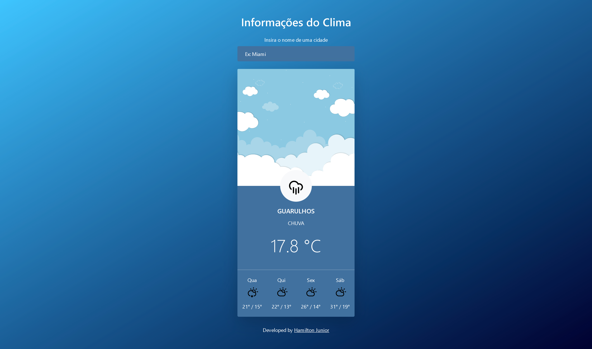

# Weather App

  

---

# Index

- [Weather App](#weather-app)
- [Index](#index)
  - [📄 Project Description](#-project-description)
  - [💻 Usage](#-usage)
  - [🚀 Technologies used](#-technologies-used)
  - [😃 Autor: Hamilton Junior](#-autor-hamilton-junior)

---

## 📄 Project Description
This is a simple **weather app** project, and it is one of the challenges of [CJRM](https://github.com/roger-melo-treinamentos/curso-de-js-roger-melo) training.

---

## 💻 Usage
No need to install anything. Just download the project, open the index.html file in your favorite browser and search any city in the world! [or try it out here!](https://hjr-weather-app.netlify.app/).

---

## 🚀 Technologies used
- Semantic HTML5 markup
- CSS3
- CSS custom properties
- Bootstrap
- JavaScript
- [AccuWeather APIs](https://developer.accuweather.com/)

---

## 😃 Autor: Hamilton Junior

